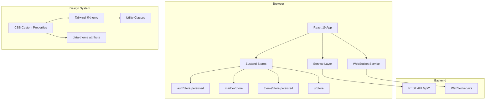
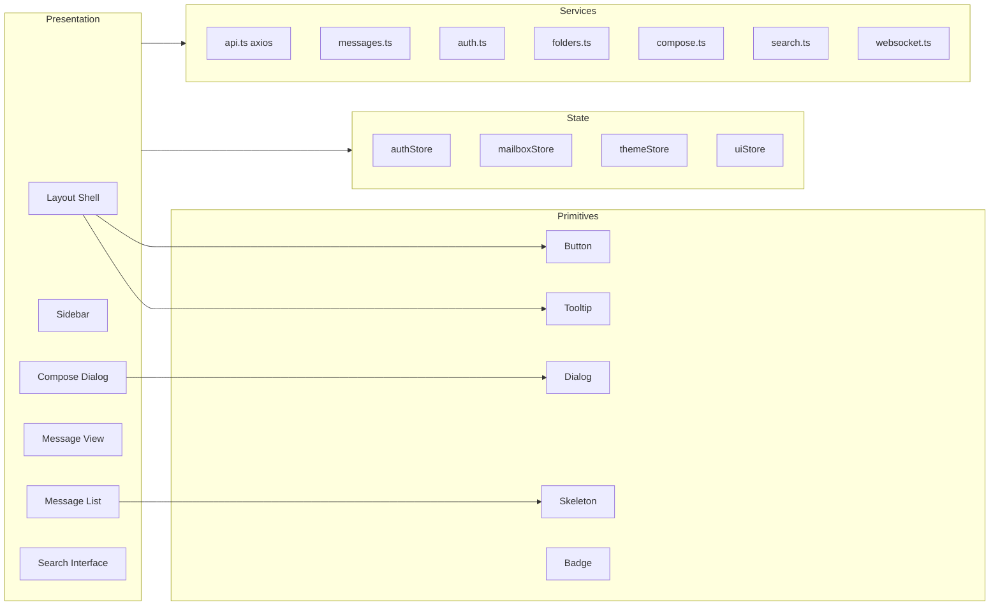

# Technical Design Document: Frontend Redesign

## Overview

This document defines the technical architecture for a complete frontend redesign of the Openvelope application. The redesign delivers a premium, polished experience inspired by Linear, Superhuman, and Arc Browser while preserving the existing backend API contracts (REST + WebSocket).

The design follows Emil Kowalski's design engineering philosophy: unseen details compound into interfaces people love. Every motion decision, token value, and interaction response time is intentional. The motion personality is **Premium** — elegant, minimal, sophisticated — using longer durations (350–600ms for modals), signature easing `cubic-bezier(0.16, 1, 0.3, 1)` (ease-out-expo), and zero overshoot.

### Key Architectural Decisions

| Decision | Choice | Rationale |
|----------|--------|-----------|
| Design tokens | CSS custom properties + Tailwind v4 `@theme` | Single source of truth, zero-runtime theme switching |
| Theme engine | Zustand store + `data-theme` attribute on `<html>` | Instant DOM update, no flash, SSR-compatible pattern |
| Motion system | CSS transitions only (no keyframes for UI) | Interruptible, GPU-composited, no JS runtime cost |
| Virtualization | @tanstack/react-virtual | Already in deps, handles 1000+ items at 60fps |
| Rich text | TipTap 3 (lazy-loaded) | Already in deps, split from initial bundle |
| State management | Zustand 5 (existing stores preserved) | Minimal boilerplate, external-access pattern for services |
| Routing | React Router v7 (existing) | Route-level code splitting via `React.lazy` |
| Styling | Tailwind CSS v4 with `@theme` | Utility-first, design tokens as utilities |

### Tech Stack Versions

- React 19.2, Vite 8, Tailwind CSS 4.3, Zustand 5, TipTap 3, @tanstack/react-virtual 3

---

## Architecture

### High-Level System Diagram



### Application Layer Architecture



### Directory Structure

```
frontend/src/
├── app/
│   ├── App.tsx                   # Router + providers
│   └── routes/                   # Route-level code-split pages
│       ├── Login.tsx
│       └── Mailbox.tsx
├── components/
│   ├── primitives/               # Design system atoms
│   │   ├── Button.tsx
│   │   ├── Tooltip.tsx
│   │   ├── Dialog.tsx
│   │   ├── Skeleton.tsx
│   │   └── Badge.tsx
│   ├── layout/
│   │   ├── LayoutShell.tsx       # 3-panel responsive container
│   │   ├── Sidebar.tsx
│   │   └── ResizeDivider.tsx
│   ├── mail/
│   │   ├── MessageList.tsx       # Virtualized list
│   │   ├── MessageRow.tsx
│   │   ├── MessageView.tsx
│   │   ├── ComposeDialog.tsx
│   │   ├── BatchToolbar.tsx
│   │   └── AttachmentChip.tsx
│   └── search/
│       └── SearchInterface.tsx
├── hooks/
│   ├── useWebSocket.ts
│   ├── useMailboxUpdates.ts
│   ├── useTheme.ts
│   ├── usePrefetch.ts
│   └── useReducedMotion.ts
├── stores/
│   ├── authStore.ts              # Preserved
│   ├── mailboxStore.ts           # Preserved
│   ├── themeStore.ts             # New
│   └── uiStore.ts               # New (panels, compose state)
├── services/                     # Preserved unchanged
│   ├── api.ts
│   ├── auth.ts
│   ├── compose.ts
│   ├── folders.ts
│   ├── messages.ts
│   ├── search.ts
│   └── websocket.ts
├── styles/
│   ├── tokens.css                # CSS custom properties
│   └── index.css                 # @import "tailwindcss" + @theme
├── types/
│   └── index.ts                  # Preserved
└── lib/
    ├── motion.ts                 # Motion utilities (stagger, transition classes)
    ├── sanitize.ts               # HTML sanitizer for message view
    └── format.ts                 # Date/size formatting utilities
```

---

## Components and Interfaces

### 1. Design Token System (`styles/tokens.css`)

Tokens are defined as CSS custom properties on `:root` (light) and `[data-theme="dark"]`. Tailwind v4's `@theme` maps tokens to utilities.

```css
/* styles/tokens.css */
:root {
  /* Color — Semantic Roles */
  --color-bg: #ffffff;
  --color-surface: #f8f9fa;
  --color-surface-elevated: #ffffff;
  --color-text-primary: #111111;
  --color-text-secondary: #6b7280;
  --color-border: #e5e7eb;
  --color-accent: #2563eb;
  --color-accent-hover: #1d4ed8;
  --color-error: #dc2626;
  --color-success: #16a34a;

  /* Spacing Scale (4px base) */
  --space-1: 4px;
  --space-2: 8px;
  --space-3: 12px;
  --space-4: 16px;
  --space-5: 24px;
  --space-6: 32px;
  --space-7: 48px;
  --space-8: 64px;

  /* Border Radius */
  --radius-sm: 4px;
  --radius-md: 8px;
  --radius-lg: 12px;

  /* Shadows */
  --shadow-low: 0 1px 2px rgba(0, 0, 0, 0.05);
  --shadow-md: 0 4px 12px rgba(0, 0, 0, 0.08);
  --shadow-high: 0 8px 24px rgba(0, 0, 0, 0.12);

  /* Typography */
  --font-sans: "Inter", system-ui, -apple-system, sans-serif;
  --font-mono: "JetBrains Mono", ui-monospace, monospace;
  --text-xs: 0.75rem;
  --text-sm: 0.875rem;
  --text-base: 1rem;
  --text-lg: 1.125rem;
  --leading-tight: 1.25;
  --leading-normal: 1.5;
  --leading-relaxed: 1.625;

  /* Motion Tokens */
  --duration-fast: 150ms;
  --duration-normal: 200ms;
  --duration-slow: 250ms;
  --duration-slower: 350ms;
  --ease-out-expo: cubic-bezier(0.16, 1, 0.3, 1);
  --ease-in-quad: cubic-bezier(0.55, 0.085, 0.68, 0.53);
  --ease-spring: cubic-bezier(0.175, 0.885, 0.32, 1.075);
  --stagger-sm: 30ms;
  --stagger-md: 50ms;
  --stagger-lg: 80ms;
}

[data-theme="dark"] {
  --color-bg: #09090b;
  --color-surface: #18181b;
  --color-surface-elevated: #27272a;
  --color-text-primary: #fafafa;
  --color-text-secondary: #a1a1aa;
  --color-border: #3f3f46;
  --color-accent: #3b82f6;
  --color-accent-hover: #60a5fa;
  --color-error: #ef4444;
  --color-success: #22c55e;

  --shadow-low: 0 1px 2px rgba(0, 0, 0, 0.3);
  --shadow-md: 0 4px 12px rgba(0, 0, 0, 0.4);
  --shadow-high: 0 8px 24px rgba(0, 0, 0, 0.5);
}
```

**Tailwind v4 Integration (`styles/index.css`):**

```css
@import "tailwindcss";

@theme {
  --color-bg: var(--color-bg);
  --color-surface: var(--color-surface);
  --color-surface-elevated: var(--color-surface-elevated);
  --color-text-primary: var(--color-text-primary);
  --color-text-secondary: var(--color-text-secondary);
  --color-border: var(--color-border);
  --color-accent: var(--color-accent);
  --color-accent-hover: var(--color-accent-hover);
  --color-error: var(--color-error);
  --color-success: var(--color-success);

  --spacing-1: var(--space-1);
  --spacing-2: var(--space-2);
  --spacing-3: var(--space-3);
  --spacing-4: var(--space-4);
  --spacing-5: var(--space-5);
  --spacing-6: var(--space-6);
  --spacing-7: var(--space-7);
  --spacing-8: var(--space-8);

  --radius-sm: var(--radius-sm);
  --radius-md: var(--radius-md);
  --radius-lg: var(--radius-lg);
}
```

### 2. Theme Engine (`stores/themeStore.ts`)

```typescript
import { create } from 'zustand'
import { persist } from 'zustand/middleware'

type ThemeMode = 'light' | 'dark' | 'system'
type ResolvedTheme = 'light' | 'dark'

interface ThemeState {
  mode: ThemeMode
  resolved: ResolvedTheme
  setMode: (mode: ThemeMode) => void
}

function getSystemTheme(): ResolvedTheme {
  return window.matchMedia('(prefers-color-scheme: dark)').matches ? 'dark' : 'light'
}

function applyTheme(theme: ResolvedTheme): void {
  document.documentElement.setAttribute('data-theme', theme)
}

function resolve(mode: ThemeMode): ResolvedTheme {
  return mode === 'system' ? getSystemTheme() : mode
}

export const useThemeStore = create<ThemeState>()(
  persist(
    (set) => ({
      mode: 'system',
      resolved: getSystemTheme(),
      setMode: (mode) => {
        const resolved = resolve(mode)
        applyTheme(resolved)
        set({ mode, resolved })
      },
    }),
    {
      name: 'openvelope-theme',
      onRehydrateStorage: () => (state) => {
        if (state) {
          const resolved = resolve(state.mode)
          applyTheme(resolved)
          state.resolved = resolved
        }
      },
    },
  ),
)

// Listen for OS preference changes when mode is 'system'
if (typeof window !== 'undefined') {
  window.matchMedia('(prefers-color-scheme: dark)').addEventListener('change', () => {
    const { mode } = useThemeStore.getState()
    if (mode === 'system') {
      const resolved = getSystemTheme()
      applyTheme(resolved)
      useThemeStore.setState({ resolved })
    }
  })
}
```

**Theme transition CSS (applied globally):**

```css
html {
  transition: background-color 200ms ease, color 200ms ease;
}
```

### 3. Motion System (`lib/motion.ts`)

The motion system is CSS-first with a thin TypeScript utility layer for stagger calculation.

```typescript
/**
 * Calculates stagger delay for list item animations.
 * Items beyond MAX_STAGGER render immediately (delay = 0).
 */
const MAX_STAGGER_ITEMS = 10

export function staggerDelay(index: number, intervalMs: number = 30): number {
  if (index >= MAX_STAGGER_ITEMS) return 0
  return index * intervalMs
}

/**
 * Returns inline style for stagger entrance animation.
 * Used with CSS: opacity 0 + translateY(4px) → opacity 1 + translateY(0)
 */
export function staggerStyle(index: number, intervalMs?: number): React.CSSProperties {
  const delay = staggerDelay(index, intervalMs)
  return {
    transitionDelay: delay > 0 ? `${delay}ms` : undefined,
    opacity: 0,
    transform: 'translateY(4px)',
  }
}

/** Easing tokens for programmatic use */
export const easing = {
  outExpo: 'cubic-bezier(0.16, 1, 0.3, 1)',
  inQuad: 'cubic-bezier(0.55, 0.085, 0.68, 0.53)',
  spring: 'cubic-bezier(0.175, 0.885, 0.32, 1.075)',
} as const

/** Duration tokens for programmatic use */
export const duration = {
  fast: 150,
  normal: 200,
  slow: 250,
  slower: 350,
} as const
```

**Reduced motion hook (`hooks/useReducedMotion.ts`):**

```typescript
import { useSyncExternalStore } from 'react'

const query = typeof window !== 'undefined'
  ? window.matchMedia('(prefers-reduced-motion: reduce)')
  : null

function subscribe(callback: () => void) {
  query?.addEventListener('change', callback)
  return () => query?.removeEventListener('change', callback)
}

function getSnapshot() {
  return query?.matches ?? false
}

export function useReducedMotion(): boolean {
  return useSyncExternalStore(subscribe, getSnapshot, () => false)
}
```

**Global reduced-motion override (in `tokens.css`):**

```css
@media (prefers-reduced-motion: reduce) {
  *, *::before, *::after {
    transition-duration: 0ms !important;
    animation-duration: 0ms !important;
    transition-delay: 0ms !important;
    animation-delay: 0ms !important;
  }
}
```

### 4. Button Primitive (`components/primitives/Button.tsx`)

```typescript
interface ButtonProps extends React.ButtonHTMLAttributes<HTMLButtonElement> {
  variant?: 'primary' | 'secondary' | 'ghost'
  size?: 'sm' | 'md' | 'lg'
  loading?: boolean
  tooltip?: string
}
```

CSS behavior (applied via Tailwind utilities + custom properties):
- `:active` → `transform: scale(0.97)` with 150ms ease-out
- Release → `transform: scale(1)` with 200ms ease-out-expo
- `:hover` → background highlight, 150ms ease-out
- `:focus-visible` → 2px ring, 2px offset, accent color, 3:1 contrast
- `disabled` → opacity 0.5, pointer-events none, cursor not-allowed, `aria-disabled`
- Minimum touch target: 44×44px

### 5. Tooltip (`components/primitives/Tooltip.tsx`)

```typescript
interface TooltipProps {
  content: string          // max 80 chars
  children: React.ReactElement
  placement?: 'top' | 'bottom' | 'left' | 'right'
  delayMs?: number         // default 500ms
}
```

Behavior:
- Initial delay: 500ms before showing
- Warm-up: if another tooltip closed within 300ms, show immediately
- Enter: scale(0.96) + opacity 0 → scale(1) + opacity 1, 200ms ease-out-expo
- Exit: 150ms ease-in-quad
- Positioning: 8px gap, auto-flip on viewport overflow
- Accessibility: `role="tooltip"`, `aria-describedby`, Escape dismisses

### 6. Layout Shell (`components/layout/LayoutShell.tsx`)

Responsive three-panel layout:

| Breakpoint | Sidebar | Message List | Message View |
|-----------|---------|-------------|--------------|
| ≥1024px | Full (240px) | Resizable (280px–50vw) | Fills remaining |
| 768–1024px | Icon rail (56px) | Resizable | Fills remaining |
| <768px | Hidden (overlay) | Single panel | Single panel (slides in) |

```typescript
interface LayoutShellProps {
  children?: React.ReactNode
}
```

Panel transitions on mobile use horizontal slide (300ms ease-out-expo), GPU-composited via `transform: translateX()`.

The resize divider constrains Message List width: min 280px, max 50vw. Uses pointer capture for smooth drag.

### 7. Sidebar (`components/layout/Sidebar.tsx`)

```typescript
// Renders from mailboxStore.folders
// Active folder highlighted with 200ms background transition
// Folder items stagger-animate on load (30ms × max 10)
// Compose button at top (44px min height, Button press behavior)
// User email + logout at bottom
// Unread badge: count > 99 displays "99+"
```

### 8. Message List (`components/mail/MessageList.tsx`)

Virtualized with `@tanstack/react-virtual`:
- Overscan: 5 items above and below visible area
- Row height: estimated 72px (subject + sender + preview + timestamp)
- Unread indicator: 6px accent dot + semibold sender/subject
- Selection: background fill, 150ms ease-out
- Pagination footer: page size selector (25, 50, 100, 200) + Prev/Next
- Batch toolbar slides from top (250ms ease-out-expo translateY)
- Stagger on page load: 30ms cascade, max 10 items

### 9. Message View (`components/mail/MessageView.tsx`)

- Enter animation: opacity 0 + translateX(8px) → resting, 250ms ease-out-expo
- Headers: from, to, cc, date in labeled vertical list
- Body: HTML sanitized (strip script, iframe, object, embed, style, link, event handlers, javascript: URIs, data: URIs)
- Plain text fallback: `<pre>` with `white-space: pre-wrap`
- Attachments: filename + human-readable size + download button
- Actions: Reply, Forward (Button press behavior)
- Loading state: skeleton pulse (opacity 0.4–0.7, 1.5s period)
- Empty state: centered prompt

### 10. Compose Dialog (`components/mail/ComposeDialog.tsx`)

- Open: backdrop to opacity 0.3 + dialog scale(0.96)/opacity 0 → scale(1)/opacity 1, 300ms ease-out-expo
- Close: scale(0.98)/opacity 0, 200ms ease-in-quad
- Reply mode: pre-fill recipient, "Re:" subject, blockquote original
- Forward mode: "Fwd:" subject, empty recipient, forwarded separator
- TipTap editor: lazy-loaded, formatting toolbar (bold, italic, underline, lists, link, blockquote)
- Attachments: max 25MB/file, max 10 files, chip display with remove
- Focus trap while open, return focus on close
- Error: inline red message, dialog stays open, content preserved

### 11. Search Interface (`components/search/SearchInterface.tsx`)

- Open: Cmd/Ctrl+K, centered command-palette overlay, scale(0.96)/opacity 0, 250ms ease-out-expo
- Input: searches from/to/subject/body, min 2 chars, 300ms debounce
- Results: up to 50, scrollable, same row layout as MessageList
- Select result: close overlay, navigate to message in folder
- Close: Escape or click outside, 150ms ease-in-quad exit
- Focus trap while open

### 12. WebSocket Service (Enhanced)

The existing `WebSocketService` is enhanced with exponential backoff:

```typescript
// Enhanced reconnection parameters
const INITIAL_DELAY_MS = 3000
const MAX_DELAY_MS = 30000
const MAX_RETRIES = 10
const BACKOFF_MULTIPLIER = 2

// Reconnection logic:
// delay = min(INITIAL_DELAY_MS * BACKOFF_MULTIPLIER^attempt, MAX_DELAY_MS)
// Reset attempt counter on successful connection
// After MAX_RETRIES: stop reconnecting, expose status to UI
```

Connection status exposed via a `connectionStore` or as part of `uiStore`:

```typescript
interface ConnectionState {
  status: 'connected' | 'reconnecting' | 'disconnected'
  retryCount: number
  manualRetry: () => void
}
```

---

## Data Models

### Stores (New)

**themeStore** (described above in Theme Engine section)

**uiStore:**

```typescript
interface UIState {
  // Panel visibility (mobile)
  activePanel: 'sidebar' | 'list' | 'view'
  // Compose dialog
  composeOpen: boolean
  composeMode: 'new' | 'reply' | 'forward' | null
  composeReplyTo: { to: string; subject: string; body: string } | null
  // Search
  searchOpen: boolean
  // Connection
  wsStatus: 'connected' | 'reconnecting' | 'disconnected'
  wsRetryCount: number
  // Actions
  setActivePanel: (panel: 'sidebar' | 'list' | 'view') => void
  openCompose: (mode: 'new' | 'reply' | 'forward', replyTo?: UIState['composeReplyTo']) => void
  closeCompose: () => void
  toggleSearch: () => void
  setWsStatus: (status: UIState['wsStatus'], retryCount?: number) => void
}
```

### Existing Types (Preserved)

All types in `types/index.ts` remain unchanged:
- `Folder`, `MessageFlags`, `MessageSummary`, `MessageListResponse`
- `SendEmailRequest`, `SearchQuery`, `SearchResponse`
- `LoginResponse`, `RefreshResponse`, `MeResponse`
- `MessageHeaders`, `AttachmentInfo`, `AttachmentUpload`

### Existing Services (Preserved)

All service modules remain unchanged in signature and implementation:
- `api.ts` — axios instance with auth interceptors
- `auth.ts` — login, logout, refresh, me
- `messages.ts` — listMessages, getMessage, updateFlags, deleteMessage, moveMessage, batchOperation, getMessageHeaders, listAttachments, downloadAttachment
- `folders.ts` — listFolders, createFolder, renameFolder, deleteFolder
- `compose.ts` — sendEmail, uploadAttachment
- `search.ts` — search
- `websocket.ts` — WebSocketService (enhanced with backoff, same public API)

### Existing Stores (Preserved)

- `authStore` — `accessToken`, `email`, `setAuth`, `clearAuth` (with persist middleware)
- `mailboxStore` — folders, messages, pagination, selection state (interface unchanged)

---


## Correctness Properties

*A property is a characteristic or behavior that should hold true across all valid executions of a system — essentially, a formal statement about what the system should do. Properties serve as the bridge between human-readable specifications and machine-verifiable correctness guarantees.*

### Property 1: Token structure completeness and theme parity

*For any* design token configuration, the validation function SHALL accept it only if it contains at least 5 semantic color roles, at least 6 spacing stops, at least 3 radius stops, at least 3 shadow elevations, and required typography values — AND the light and dark token sets have identical key sets (every key in light exists in dark and vice versa).

**Validates: Requirements 1.1, 1.2**

### Property 2: Theme resolution correctness

*For any* combination of stored mode ('light' | 'dark' | 'system'), OS preference ('light' | 'dark'), and localStorage availability, the theme engine SHALL:
- Resolve to the stored mode value when mode is 'light' or 'dark' (regardless of OS preference)
- Resolve to the current OS preference when mode is 'system'
- Set `document.documentElement.dataset.theme` to the resolved value
- Fall back to 'system' mode when localStorage is unavailable

**Validates: Requirements 2.2, 2.4, 2.6, 2.7, 2.8**

### Property 3: Stagger delay calculation

*For any* non-negative integer index and positive interval, `staggerDelay(index, interval)` SHALL return `index × interval` when index < 10, and 0 when index ≥ 10. Items beyond the cap render with no entrance delay.

**Validates: Requirements 3.7**

### Property 4: Interactive duration bounds

*For any* duration token categorized as "interactive" in the motion system, its value SHALL be ≤ 350ms. For any token categorized as "decorative", its value SHALL be ≤ 500ms.

**Validates: Requirements 3.6**

### Property 5: Tooltip positioning never overflows viewport

*For any* trigger element position (x, y, width, height) and viewport dimensions, the computed tooltip placement SHALL maintain an 8px gap from the trigger and the tooltip SHALL not extend beyond the viewport boundaries (flipping to the opposite side when the preferred placement would overflow).

**Validates: Requirements 5.4**

### Property 6: Tooltip warm-up behavior

*For any* sequence of tooltip show/hide events where the time between closing tooltip A and hovering tooltip B is less than 300ms, tooltip B SHALL appear with 0ms delay. When the gap exceeds 300ms, the full 500ms delay applies.

**Validates: Requirements 5.1, 5.2**

### Property 7: Tooltip text length constraint

*For any* string provided as tooltip content, the rendered tooltip text SHALL be at most 80 characters. Strings exceeding 80 characters SHALL be truncated.

**Validates: Requirements 5.7**

### Property 8: Panel resize clamping

*For any* viewport width and drag delta applied to the Message_List panel divider, the resulting panel width SHALL be clamped to the range [280px, viewport_width × 0.5].

**Validates: Requirements 7.4**

### Property 9: Unread badge formatting

*For any* non-negative integer unseen count, the badge formatter SHALL return: no badge when count is 0, the count as a string when count is 1–99, or "99+" when count exceeds 99.

**Validates: Requirements 8.1**

### Property 10: Message row rendering completeness

*For any* valid MessageSummary object, the rendered message row SHALL contain: sender name (single-line truncated), subject line (single-line truncated), preview text (≤120 characters, single-line truncated), formatted timestamp, and — when `flags.seen` is false — a 6px accent-colored unread dot with semibold sender and subject weight.

**Validates: Requirements 9.2, 9.3**

### Property 11: Pagination control disabled states

*For any* pagination state (page, pageSize, total), the Previous button SHALL be disabled when page = 0, and the Next button SHALL be disabled when (page + 1) × pageSize ≥ total.

**Validates: Requirements 9.6**

### Property 12: HTML sanitization removes all dangerous content

*For any* HTML string input, the sanitize function SHALL produce output that contains no `<script>`, `<iframe>`, `<object>`, `<embed>`, `<style>`, or `<link>` elements, no inline event handler attributes (on*), and no `javascript:` or `data:` URI schemes in href/src attributes. Additionally, for any HTML string that contains only safe elements, the sanitized output SHALL preserve the safe content structure.

**Validates: Requirements 10.3**

### Property 13: File size formatting

*For any* non-negative integer byte count, `formatSize` SHALL return: bytes with "B" suffix when < 1024, value in KB (one decimal) with "KB" suffix when < 1,048,576, or value in MB (one decimal) with "MB" suffix when ≥ 1,048,576.

**Validates: Requirements 10.5**

### Property 14: Compose reply/forward pre-fill

*For any* original message with sender, subject, and body: reply mode SHALL set recipient to original sender, prefix subject with "Re: " (unless already prefixed with "Re:"), and include original body in a blockquote. Forward mode SHALL leave recipient empty, prefix subject with "Fwd: " (unless already prefixed with "Fwd:"), and include original body below a separator.

**Validates: Requirements 11.3, 11.4**

### Property 15: Attachment validation

*For any* file size in bytes and current attachment count, the attachment validator SHALL reject the file if size > 25MB (26,214,400 bytes) or if current count ≥ 10, and SHALL accept otherwise.

**Validates: Requirements 11.6**

### Property 16: Search input validation and result capping

*For any* search input string, the search SHALL not trigger if the trimmed string length is less than 2 characters. *For any* search response containing N results, the rendered results list SHALL display at most 50 items.

**Validates: Requirements 12.2, 12.3**

### Property 17: WebSocket exponential backoff

*For any* reconnection attempt number n (0 ≤ n < 10), the computed delay SHALL equal min(3000 × 2^n, 30000) milliseconds. For attempt n ≥ 10, reconnection SHALL stop and the status SHALL transition to 'disconnected'.

**Validates: Requirements 13.4**

### Property 18: WebSocket event store mutations

*For any* `new_message` event matching the current folder, the message SHALL be prepended to the store's message list. *For any* `flags_changed` event with a valid uid present in the current message list, the corresponding message's flags SHALL be updated to reflect the new values. *For any* `message_deleted` event with a valid uid, that message SHALL be removed from the store's message list.

**Validates: Requirements 13.1, 13.2, 13.3**

### Property 19: Color contrast compliance

*For any* foreground/background color pair used in the token system (text-primary on bg, text-primary on surface, text-secondary on bg, text-secondary on surface) in both light and dark themes, the computed WCAG contrast ratio SHALL be ≥ 4.5:1 for normal text and ≥ 3:1 for large text.

**Validates: Requirements 14.4**

---

## Error Handling

### Network Errors (API Layer)

The existing `api.ts` interceptor handles 401 responses by clearing auth and redirecting to `/login`. Additional error handling:

| Scenario | Behavior |
|----------|----------|
| API request timeout | Cancel via AbortController after 30s, show error toast |
| 4xx errors (non-401) | Display contextual inline error in the originating component |
| 5xx errors | Display retry-capable error message |
| Network offline | Detect via `navigator.onLine`, show connection banner |

### WebSocket Errors

| Scenario | Behavior |
|----------|----------|
| Connection lost | Set `wsStatus: 'reconnecting'`, show subtle connection indicator |
| Reconnect attempt | Exponential backoff (3s, 6s, 12s, 24s, 30s, 30s...) |
| Max retries (10) exhausted | Set `wsStatus: 'disconnected'`, show persistent error with manual retry button |
| Successful reconnect | Reset retry counter, hide indicator, re-subscribe to events |
| Invalid message payload | Log to console, ignore malformed message, continue operating |

### Component-Level Error Handling

| Component | Error Scenario | Behavior |
|-----------|---------------|----------|
| Login | Auth failure | Shake animation + inline error, form stays editable |
| Login | Timeout (30s) | Re-enable form, show "server unreachable" error |
| MessageList | Load failure | Error message in list area, pagination state preserved |
| MessageView | Load failure | Error in view area, no navigation away |
| ComposeDialog | Send failure | Inline red error, dialog stays open, content preserved |
| ComposeDialog | TipTap load failure | Inline error with retry button |
| ComposeDialog | Attachment too large/too many | Inline validation error, file not added |
| SearchInterface | Search failure | Error message with retry option |
| Theme Engine | localStorage unavailable | Silent fallback to system mode, no user-visible error |

### Error Boundaries

A React Error Boundary wraps the top-level `<App>` to catch unhandled render errors, displaying a full-page error state with a reload action. Individual route components may have their own error boundaries for more granular recovery.

---

## Testing Strategy

### Unit Tests (Vitest)

Focus on specific examples, edge cases, and component rendering:

- **Theme store**: setMode with each value, rehydration, localStorage fallback
- **Button**: disabled state attributes, loading state rendering
- **Tooltip**: ARIA attributes, Escape key dismissal, delay timing (fake timers)
- **Login page**: error display on auth failure, loading state, timeout behavior
- **Compose dialog**: reply/forward pre-fill edge cases, TipTap load failure
- **Message view**: plain-text fallback, empty state, skeleton during load
- **Search**: keyboard shortcut, empty results message, Escape close
- **Sidebar**: folder rendering, active state, compose button
- **Accessibility**: ARIA roles on landmarks, skip link presence, focus trap

### Property-Based Tests (fast-check)

The project will use [fast-check](https://github.com/dubzzz/fast-check) for property-based testing with Vitest. Each property test runs a minimum of 100 iterations and is tagged with the design property it validates.

| Property | Module Under Test | Key Generators |
|----------|------------------|----------------|
| 1: Token validation | `lib/tokens.ts` | Arbitrary token config objects |
| 2: Theme resolution | `stores/themeStore.ts` | ThemeMode × OS preference × localStorage state |
| 3: Stagger delay | `lib/motion.ts` | Non-negative integers × positive intervals |
| 4: Duration bounds | `lib/motion.ts` | Duration token enum |
| 5: Tooltip positioning | `components/primitives/Tooltip.tsx` | Trigger rect × viewport size |
| 6: Tooltip warm-up | `components/primitives/Tooltip.tsx` | Time intervals (0–1000ms) |
| 7: Tooltip text length | `components/primitives/Tooltip.tsx` | Arbitrary strings |
| 8: Panel resize | `components/layout/LayoutShell.tsx` | Viewport widths × drag deltas |
| 9: Badge format | `lib/format.ts` | Non-negative integers |
| 10: Message row | `components/mail/MessageRow.tsx` | Arbitrary MessageSummary objects |
| 11: Pagination controls | `components/mail/MessageList.tsx` | page × pageSize × total |
| 12: HTML sanitization | `lib/sanitize.ts` | Arbitrary HTML strings (including malicious) |
| 13: File size format | `lib/format.ts` | Non-negative integers (0 to 10GB) |
| 14: Reply/Forward pre-fill | `lib/compose.ts` | Arbitrary message headers × body strings |
| 15: Attachment validation | `lib/compose.ts` | File sizes × attachment counts |
| 16: Search validation | `components/search/SearchInterface.tsx` | Arbitrary strings × result arrays |
| 17: WS backoff | `services/websocket.ts` | Attempt numbers (0–20) |
| 18: WS event mutations | `stores/mailboxStore.ts` | Arbitrary events × message lists |
| 19: Color contrast | `styles/tokens` | Token color pairs from both themes |

**Test tag format example:**
```typescript
// Feature: frontend-redesign, Property 3: For any non-negative integer index and positive interval, staggerDelay returns index × interval when index < 10, and 0 when index ≥ 10
```

### Integration Tests

- **Responsive layout**: Verify breakpoint behavior at 1024px, 768px thresholds
- **WebSocket reconnection**: Full connection lifecycle with mock WS server
- **Virtualized list**: Scroll performance with 1000+ items
- **Route code splitting**: Verify lazy chunks load correctly
- **Accessibility**: axe-core automated audit on all pages

### Performance Budget

| Metric | Target | Tool |
|--------|--------|------|
| Initial bundle (gzipped) | < 150KB | Vite build output |
| First Contentful Paint | < 1.5s | Lighthouse |
| Largest Contentful Paint | < 2.5s | Lighthouse |
| TipTap lazy load | < 2s | Performance mark |
| Message list scroll | > 55fps | Performance observer |
| Animation frame budget | < 16.7ms (95th percentile) | DevTools |

### Accessibility Testing

- **Automated**: axe-core integration in Vitest for ARIA violations
- **Manual**: Screen reader testing (VoiceOver, NVDA) for announcements, focus order, and live regions
- **Keyboard**: Tab navigation audit, focus trap verification, Escape key behavior
- **Contrast**: Token pair verification against WCAG 2.1 AA thresholds (automated via Property 19)

---
